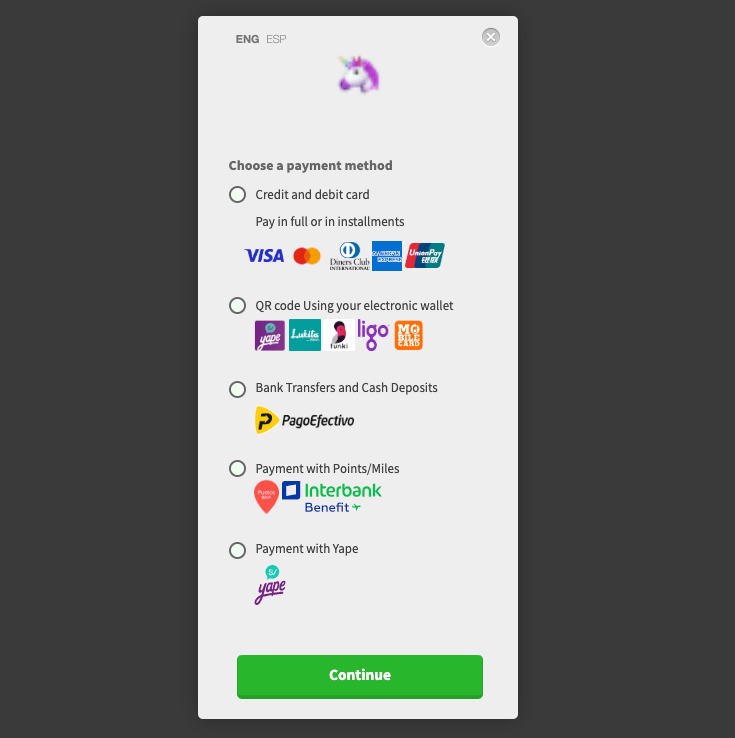

# Niubiz - Pay Form JS

Integra la pasarela de pagos de Niubiz de manera rápida y sencilla. Con este paquete, olvídate de configuraciones tediosas, problemas con CORS o la necesidad de intermediarios como proxies en tu frontend.

[Documentación completa de este paquete 📗](https://niubiz-docs.vercel.app/)



## Instalación

```sh
npm i @dankira/niubiz
```

## Integración

Este paquete es compatible con diversos frameworks y librerías como React, Vue, Angular, entre otros.

> **⚠️ Importante**
> 
> Para utilizar el modo de producción, es necesario contar con credenciales de desarrollador y la información del comercio proporcionada por Niubiz.

### Configuración

```js
import { 
    setup, 
    setInitialConfig, 
    setPaymentConfig, 
    formatResponse 
} from '@dankira/niubiz';

// Callback para manejar la respuesta de la transacción
const handleTransactionResponse = (response) => {
    console.log(response); // Información detallada de la transacción
};

// Configuración inicial de Niubiz
setInitialConfig({
    production: false, // Cambiar a 'true' para producción
    VISA_DEV_MERCHANT_ID: '456879852', // ID de comercio en entorno de pruebas
    VISA_DEV_USER: 'integraciones@niubiz.com.pe', // Usuario de integración
    VISA_DEV_PWD: '_7z3@8fF', // Contraseña de integración
    VISA_PROD_MERCHANT_ID: '', // Producción
    VISA_PROD_USER: '', // Producción
    VISA_PROD_PWD: '', // Producción
    responseUrl: '/success', // IMPORTANTE: Ruta donde se recibirá la respuesta de la transacción
});

// Configuración del pago
setPaymentConfig({
    amount: 10, // Monto de la transacción
    antifraud: {
        merchantDefineData: {
            MDD4: 'integraciones@niubiz.com.pe', // Email del cliente
            MDD21: 1,
            MDD32: 'JD1892639123',
            MDD75: 'Registrado',
            MDD77: 450
        }
    },
    channel: 'web' // Canal de pago (web, móvil, etc.)
});

// Ejecutar en la ruta definida en 'responseUrl' para procesar la respuesta
formatResponse(handleTransactionResponse);

```

> **📚 Parametros**
> 
> Todos los códigos ```MDD``` de Niubiz: https://drive.google.com/file/d/1ylRwHM6vvqnRRV6dwkIFAS5gyHSQbT2D/view


### Vista
```html
<div>
    <button @click="setup()">Iniciar Pago</button>
    <form id="frmVisaNet" method="POST" action=""></form>
</div>
```


El botón para iniciar el pago ```(<button>)``` puede ser reemplazado por un checkbox, lo importante es que la función ```setup()``` se ejecute tras haber configurado correctamente la integración y los datos del pago.

> **💡 Recomendación de Niubiz**
> 
> Para pasar a producción, se recomienda utilizar un checkbox de aceptación de términos y condiciones antes de habilitar la ejecución del pago.


## Listo ☘️

Ya tienes implementado el formulario de pago de Niubiz 🚀


## 🚨 Problemas Comunes
- CORS: Si experimentas problemas con CORS, asegúrate de que tu servidor permita las solicitudes desde tu dominio o utiliza un servidor proxy para manejar las solicitudes.
- Errores de autenticación: Verifica que la clave pública y las credenciales de la cuenta Niubiz estén configuradas correctamente.

## 💬 Contribuciones
¡Las contribuciones son bienvenidas! Si encuentras errores o tienes sugerencias, por favor abre un issue o pull request. Asegúrate de seguir las pautas de contribución detalladas en el archivo CONTRIBUTING.md.

## 📜 Licencia
Este proyecto está bajo la Licencia MIT. Para más detalles, consulta el archivo LICENSE.

## 👥 Autor
Antony Ayansi

[GitHub](https://github.com/antonyayansi) | [Twitter](https://x.com/_dankira_) | [LinkedIn](https://www.linkedin.com/in/antonyayansi/)

## Otros proyectos

[Izipay Form](https://izipay-docs.vercel.app/)